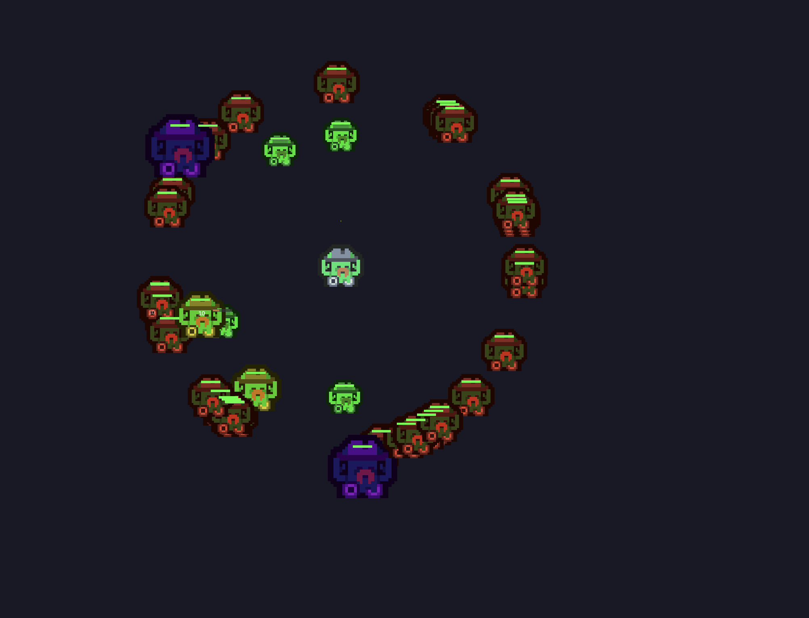
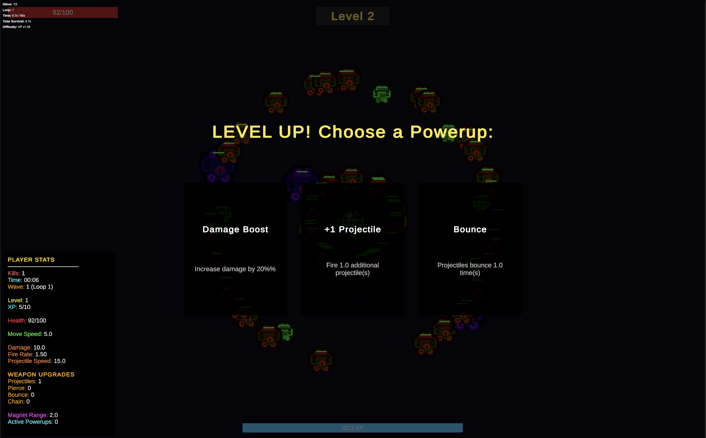

# CVA - Arena Survival Game

**CVA** is a top-down arena survival game built in Unity, inspired by the Vampire Survivors genre.

## Screenshots


*Early game: Fighting the first wave of enemies with basic projectile weapon*


*Mid-game: Multiple weapons active with powerup selection UI*

## Game Overview

Survive endless waves of enemies while leveling up and choosing powerful upgrades. Battle through increasingly difficult loops as enemy stats scale exponentially. How long can you survive?

### Core Gameplay
- **Movement:** WASD keyboard controls with smooth physics-based movement
- **Combat:** Automatic weapons that target and fire at nearby enemies
- **Progression:** Collect XP from defeated enemies to level up
- **Powerups:** Choose from 16+ different powerup types on each level up
- **Difficulty Scaling:** Wave-based progression with exponential difficulty loops

## Features

### Weapon Systems (6 Types)
1. **Projectile Weapon** - Auto-aim bullets with pierce and bounce mechanics
2. **Laser Weapon** - Rotating laser beam that continuously damages enemies
3. **Lightning Weapon** - Chain lightning that jumps between enemies
4. **Orbiting Weapon** - Projectiles that orbit around the player for defense
5. **Explosion Weapon** - Area-of-effect burst damage
6. **Ground AOE Weapon** - Stationary damage zones

### Powerup System
- **Stat Upgrades:** Damage, Fire Rate, Move Speed, Max Health, Health Regen
- **Pickup Bonuses:** Pickup Range, Magnet strength
- **Projectile Upgrades:** Projectile Speed, Pierce, Bounce, Chain
- **Area Effects:** Area, Duration, Amount
- **Weapon Unlocks:** Unlock new weapons through powerups

### Wave Management
- Timed waves with configurable duration
- Infinite loop system - waves restart with increased difficulty
- **Difficulty Scaling per Loop:**
  - +50% Enemy Health (1.5x multiplier)
  - +30% Enemy Damage (1.3x multiplier)
  - +20% Enemy Speed (1.2x multiplier)
- Exponential scaling for endless replayability

### Enemy System
- Simple chase AI with physics-based movement
- Contact damage with cooldown intervals
- Health bars and visual feedback
- XP orbs spawn on death with magnet effect
- Stats scale with wave difficulty

### UI Systems
- Health bar with visual feedback
- XP bar with level progression
- Powerup selection UI (pauses game on level up)
- Game over screen with statistics
- Floating damage numbers
- Wave and loop counter

## Technical Implementation

### Architecture & Design Patterns

**Component-Based Architecture**
- Weapons implemented as MonoBehaviour components
- Modular, reusable, follows Unity philosophy
- Dynamic weapon addition via `AddComponent`

**ScriptableObject Data Architecture**
- Data-driven design for easy balancing
- 5 ScriptableObject types: WaveData, EnemyData, PowerupData, WeaponData, XPOrbData
- Create new content without code changes

**Singleton Pattern**
- Used for global managers (GameStatsManager, HighscoreManager)
- Single source of truth for game state

**Event-Driven Communication**
- UnityEvents for loose coupling between systems
- Easy to extend and debug
- Inspector-visible event connections

**Object Pooling (Interface Ready)**
- IPoolable interface prepared for optimization
- Ready for performance improvements

### Code Organization

```
Assets/_Project/
├── Scripts/
│   ├── Combat/       # Weapon systems and projectiles
│   ├── Core/         # Core managers (Wave, XP, Stats, VFX)
│   ├── Data/         # ScriptableObject data classes
│   ├── Enemies/      # Enemy AI and spawning
│   ├── Player/       # Player controller, health, weapons
│   ├── UI/           # UI components
│   └── Editor/       # Editor tools and setup scripts
├── Data/             # ScriptableObject assets
├── Prefabs/          # Game object prefabs
└── Scenes/           # Game scenes
```

**Namespaces:**
- `CVA.Core` - Core systems
- `CVA.Player` - Player-specific scripts
- `CVA.Combat` - Combat systems
- `CVA.Enemies` - Enemy systems
- `CVA.UI` - UI components
- `CVA.Data` - Data classes

### Performance Optimizations
- Component caching (GetComponent only in Awake/Start)
- Minimal FindObject* calls
- Timer-based logic instead of per-frame checks
- Physics optimization with collision layers
- Prepared for object pooling implementation

## Development

### Built With
- **Engine:** Unity 2022+
- **Language:** C#
- **Render Pipeline:** Universal Render Pipeline (URP)
- **Input System:** Unity New Input System
- **Physics:** Unity 2D Physics (Rigidbody2D)

### Unity Packages
- Universal RP
- TextMesh Pro
- Input System
- 2D Sprite packages

### Best Practices Applied
- XML documentation on public APIs
- Cached component references
- Proper namespace organization
- ScriptableObject data architecture
- Event-driven design
- SOLID principles

## Game Stats Tracking
- Total enemies killed
- Survival time (formatted MM:SS)
- Highest wave reached
- Highest loop reached
- Highscore persistence

## How to Play

1. **Movement:** Use WASD keys to move around the arena
2. **Survive:** Avoid enemy contact damage while your weapons auto-fire
3. **Collect XP:** Pick up XP orbs from defeated enemies
4. **Level Up:** Choose powerups when you level up
5. **Survive Longer:** Keep leveling up and getting stronger
6. **Beat Your Score:** Try to survive longer and reach higher waves

## Future Improvements
- Object pooling for projectiles and enemies
- Audio system (music, SFX, AudioMixer)
- More weapon variety (summoning, boomerang, shields)
- Visual polish (camera shake, screen effects, particle trails)
- Meta progression between runs
- Save system for highscores and unlocks
- Multiple character options
- Achievement system

## Project Status
Active development - School project

## License
Educational project

---

**Game Type:** Arena Survival / Roguelike
**Platform:** PC (Windows/macOS)
**Target:** 60+ FPS
**Development Time:** October 2024
